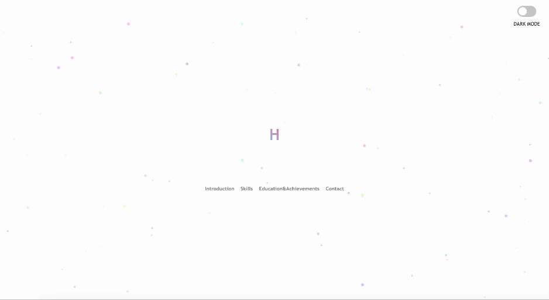
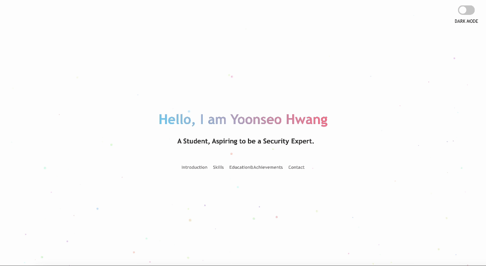

# H4RURAKA GitHub Page

제 개인 GitHub 페이지 프로젝트입니다. 이 페이지는 저를 소개하기 위한 웹사이트입니다.

This is my personal GitHub page project. This website serves as an introduction to myself.

## 시작하기 (Getting Started)

이 프로젝트는 GitHub Pages를 통해 호스팅됩니다.

다음 링크를 클릭하여 접속하실 수 있습니다. [H4RURAKA GitHub Page](https://h4ruraka.github.io/)

This project is hosted through GitHub Pages.

You can view the website at the following link: [H4RURAKA GitHub Page](https://h4ruraka.github.io/)

## 사용된 기술 (Technologies Used)

-   HTML
-   CSS
-   Vanilla Javascript

## 기능 및 스크린샷 (Features and Screenshots)

-   The Typing Effect

-   Darkmode Toggles

-   You can see others in [Page](https://h4ruraka.github.io/)

## 연락처 정보 (Contact Information)

-   H4RURAKA - [GitHub](https://github.com/H4RURAKA)
-   E-mail : qwdfgqw@naver.com
-   Elses in the last of [Page](https://h4ruraka.github.io/)

## 라이선스 (License)

이 프로젝트는 MIT 라이선스 하에 배포됩니다. 자세한 내용은 [LICENSE.md](LICENSE.md) 파일을 참조하세요.

This project is distributed under the MIT license. For more information, see the [LICENSE.md](LICENSE.md) file.
